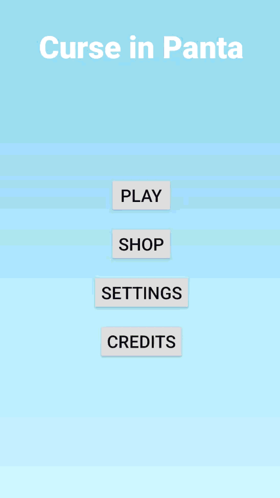
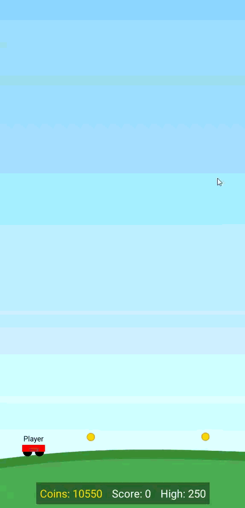
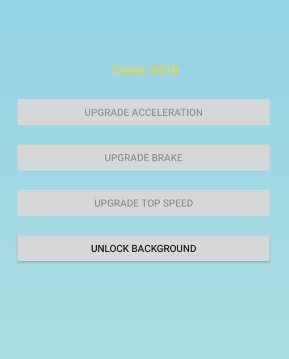
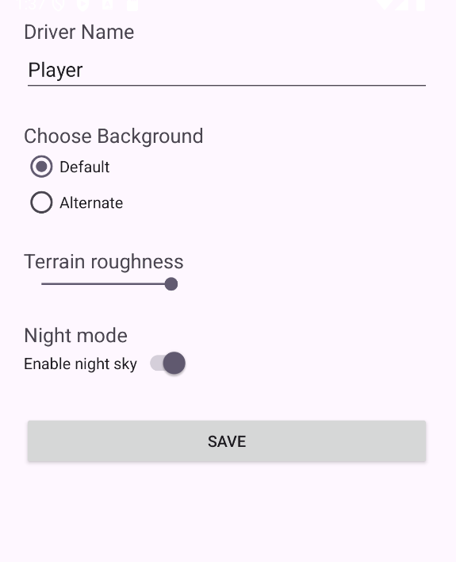

# Curse in Panta 🚗

`Curse in Panta` is a 2D physics-based driving game prototype, inspired by classics like *Hill Climb Racing*. This project was originally developed as a school assignment, focusing on implementing core game loops, physics, and local database management. 
It showcases core gameplay mechanics, including vehicle physics, collision detection, a persistent economy, and player customization.

## 🎮 Showcase

| Main Menu | Gameplay | Shop | Settings |
| :---: | :---: | :---: | :---: |
|  |  |  |  |

---

## ✨ Key Features

### Core Gameplay
* **Physics-Based Driving:** Simple and fun vehicle controller with acceleration, braking, and gravity.
* **Coin Collection:** Dynamically spawned coins can be collected by the player.
* **Collision Detection:** Basic collision handling with the generated terrain.
* **Scoring System:** Tracks the player's current score and saves their all-time high score.

### Data Persistence & Customization
* **Local Database:** Player currency (coins) and high scores are saved to a local database , ensuring data persists between game sessions.
* **Shop System:** Players can spend their collected coins to:
    * Upgrade **Acceleration**
    * Upgrade **Brake**
    * Upgrade **Top Speed**
    * Unlock an **Alternate Background**
* **Settings Menu:**
    * Set a custom **Player Name**.
    * Choose between **Default** and **Alternate** backgrounds.
    * Adjust **Terrain Roughness** with a slider.
    * Toggle **Night Mode** for the sky.

---

## 🛠️ Tech Stack

This prototype was built using:

* **Language:** [Java]
* **Framework / Engine:** [Android SDK]
* **Database:** [SQLite,SharedPreferences] for local data persistence.
* **Physics:** [Custom-built with engine-provided features from Box2D]

---

